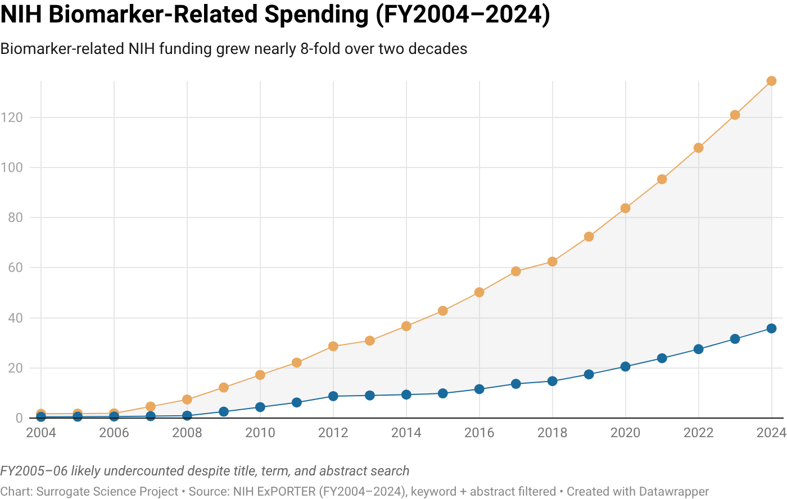
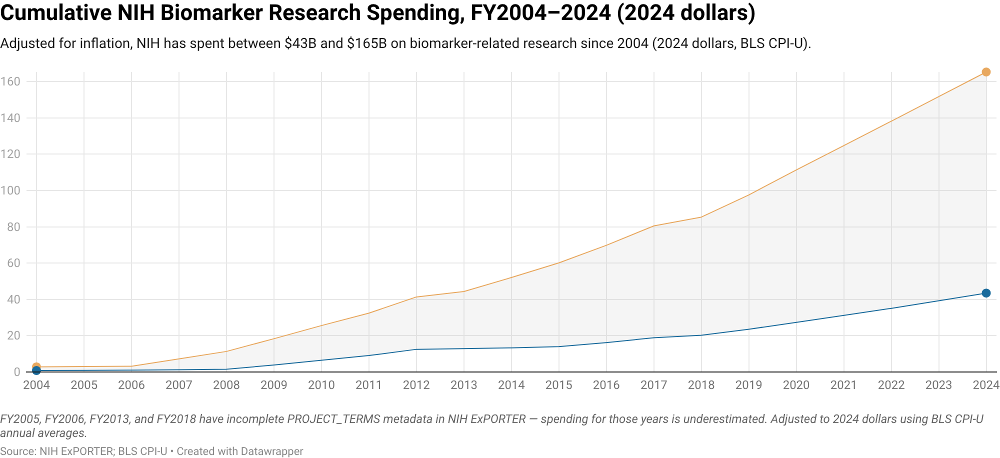

# Biomarker Research Funding

NIH has spent between **$62B and $175B** on biomarker-related research since 2004, depending on how broadly "biomarker" is defined. The true figure likely falls closer to the middle.

*Click charts to open the interactive version.*

## How these numbers were developed

We searched NIH Reporter — the public database of all federally funded NIH grants — for biomarker-relevant research using keyword searches on project titles, terms, and abstracts. Facilities and administrative grants were excluded.

The **core term set ($62B)** counts grants that explicitly name biomarker concepts: *biomarker, clinical marker, surrogate endpoint, imaging marker, endophenotype, intermediate outcome, intermediate endpoint, digital endpoint, risk stratification, patient selection, companion diagnostic, predicting response,* and *response to therapy*. This is a conservative estimate.

The **expanded term set ($175B)** adds broader diagnostic, prognostic, stratification, and precision medicine language, attempting to capture all biomarker-relevant research including grants that do not use explicit biomarker terminology.

Annual totals span FY2004–2024. FY2005 and FY2006 are likely undercounted due to incomplete metadata in NIH ExPORTER, partially recovered by searching grant abstracts. Phase 2 of this project will provide a more precise estimate through LLM-graded evaluation of individual grants.

---

**Forthcoming:** In the next phase of this project, we will study the landscape of biomarker R&D and how discovery & development (mis)align with intended clinical and regulatory use cases. Please get in touch with [manjari@manjarinarayan.com](mailto:manjari@manjarinarayan.com) if you are interested in updates.

## Data

- [biomarker_cumulative_funding_by_year.csv](data/fig-1/biomarker_cumulative_funding_by_year.csv) — core term set, annual and cumulative funding (nominal)
- [extended_biomarker_cumulative_funding_by_year.csv](data/fig-1/extended_biomarker_cumulative_funding_by_year.csv) — expanded term set, annual and cumulative funding (nominal)
- [biomarker_funding_2004_2024_with_cpi_adjustment.csv](data/fig-1/biomarker_funding_2004_2024_with_cpi_adjustment.csv) — both term sets, nominal and 2024-dollar adjusted (BLS CPI-U)
