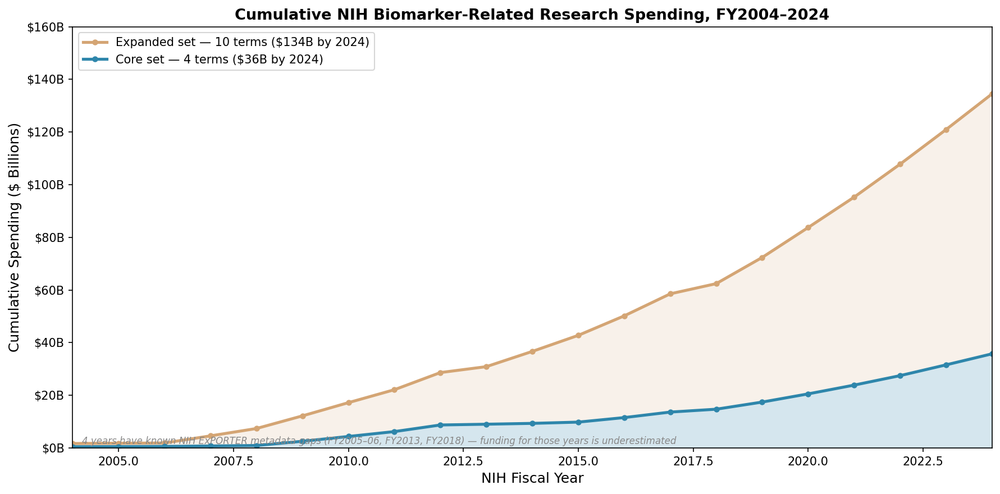

# Biomarker Research Funding

Between 2004 and 2024, NIH funded approximately **$36B to $134B** of biomarker-related research.

## How these numbers were developed

We screened NIH Reporter — the publicly available database of all federally funded NIH research — for biomarker-relevant grants using keyword searches on project titles and terms. This is an initial, broad screen: grants are included if they match any term in a **core set** (*biomarker*, *clinical marker*, *surrogate endpoint*, *imaging marker*) or an **expanded set** that adds *digital biomarker*, *intermediate outcome*, *endophenotype*, *genetic marker*, *clinical+omics*, and *clinical+imaging*. We assume that omics or imaging research with explicit clinical intent is likely biomarker-related. Some grants may prove only tangentially relevant. Annual totals span FY2004–2024; four years (FY2005, FY2006, FY2013, FY2018) have known metadata gaps.

## Data

- [`data/fig-1/biomarker_cumulative_funding_by_year.csv`](data/fig-1/biomarker_cumulative_funding_by_year.csv) — core 4-term set, annual and cumulative funding
- [`data/fig-1/extended_biomarker_cumulative_funding_by_year.csv`](data/fig-1/extended_biomarker_cumulative_funding_by_year.csv) — expanded 10-term set, annual and cumulative funding

